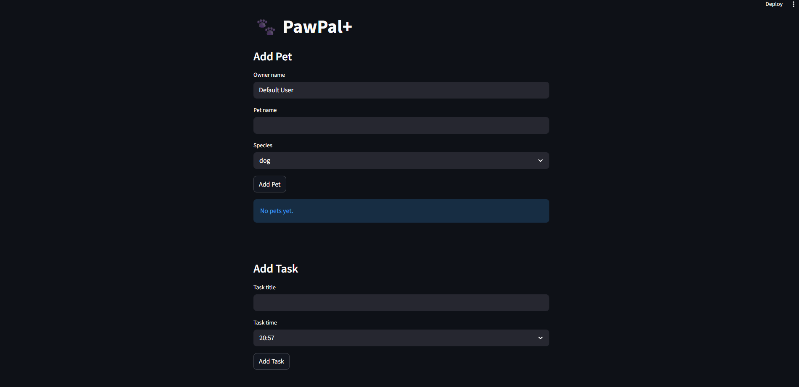

# PawPal+ (Module 2 Project)

You are building **PawPal+**, a Streamlit app that helps a pet owner plan care tasks for their pet.

## Scenario

A busy pet owner needs help staying consistent with pet care. They want an assistant that can:

- Track pet care tasks (walks, feeding, meds, enrichment, grooming, etc.)
- Consider constraints (time available, priority, owner preferences)
- Produce a daily plan and explain why it chose that plan

Your job is to design the system first (UML), then implement the logic in Python, then connect it to the Streamlit UI.

## What you will build

Your final app should:

- Let a user enter basic owner + pet info
- Let a user add/edit tasks (duration + priority at minimum)
- Generate a daily schedule/plan based on constraints and priorities
- Display the plan clearly (and ideally explain the reasoning)
- Include tests for the most important scheduling behaviors

## Getting started

### Setup

```bash
python -m venv .venv
source .venv/bin/activate  # Windows: .venv\Scripts\activate
pip install -r requirements.txt
```

### Suggested workflow

1. Read the scenario carefully and identify requirements and edge cases.
2. Draft a UML diagram (classes, attributes, methods, relationships).
3. Convert UML into Python class stubs (no logic yet).
4. Implement scheduling logic in small increments.
5. Add tests to verify key behaviors.
6. Connect your logic to the Streamlit UI in `app.py`.
7. Refine UML so it matches what you actually built.

### Smarter Scheduling
Use the Generate documentation smart action to add docstrings to your new algorithmic methods.


Update your README.md with a short section called Smarter Scheduling summarizing your new features.


Commit and push your changes directly to the main branch:

git add .
git commit -m "feat: implement sorting, filtering, and conflict detection"
git push origin main

### Testing Pawpal+
The tests verify the core functionality of the PawPal+ system, including:

Sorting: Ensures tasks are returned in correct chronological order
Recurring Tasks: Confirms that daily tasks automatically generate a new task for the next day when completed
Conflict Detection: Verifies that the system detects tasks scheduled at the same time and returns a warning

These tests help ensure that the scheduling logic behaves correctly and consistently.
### Confidence Level 4/5
The tests verify the core functionality of the PawPal+ system, including:

Sorting: Ensures tasks are returned in correct chronological order
Recurring Tasks: Confirms that daily tasks automatically generate a new task for the next day when completed
Conflict Detection: Verifies that the system detects tasks scheduled at the same time and returns a warning

These tests help ensure that the scheduling logic behaves correctly and consistently.

## Features
Features

PawPal+ includes intelligent scheduling features to help manage pet care tasks efficiently:

Task Sorting
Tasks are automatically sorted in chronological order for a clear daily schedule.
Filtering System
Tasks can be filtered by:
Pet name
Completion status (pending or completed)
Recurring Tasks
Daily and weekly tasks automatically generate a new occurrence when completed.
Conflict Detection
The system detects tasks scheduled at the same exact time and displays warnings without interrupting execution.
Clean UI Integration
All scheduling logic is reflected in the Streamlit interface with structured tables and visual feedback.
